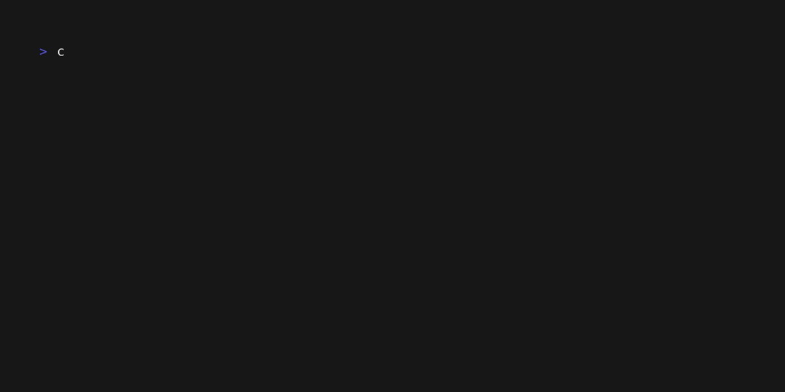

-----

# Compilador [gc]

Este repositorio contiene el código fuente de un compilador simple, single-threaded desarrollado en C++17. El proyecto traduce código fuente de alto nivel a **WebAssembly Text Format (`.wat`)** y, si las herramientas están disponibles, ensambla automáticamente el binario ejecutable (`.wasm`).

El proyecto utiliza **Docker** para garantizar un entorno de compilación consistente y evitar problemas de dependencias.



-----

## Características ✨

* **C++ Moderno:** Construido usando características de C++17, incluyendo `<filesystem>` para gestión de rutas multiplataforma.
* **Target WebAssembly:** Genera código intermedio `.wat` legible por humanos.
* **Ensamblado Automático:** El compilador detecta si `wat2wasm` (del kit WABT) está instalado en el entorno y genera el binario `.wasm` automáticamente.
* **CLI Flexible:** Una interfaz de línea de comandos robusta para una operación sencilla (flags `-i`, `-o`, etc).
* **Entorno de Ejecución:** Incluye un entorno anfitrión simple en HTML/JS para ejecutar y visualizar el resultado en un navegador.

-----

## Requisitos Previos 📋

1.  **Docker:** Es el único requisito obligatorio para compilar el proyecto.
2.  **WABT (Opcional):** Si deseas que el compilador genere automáticamente el archivo `.wasm` final:
    * Si ejecutas el binario **localmente** (fuera de Docker), debes instalar WABT en tu sistema (`sudo pacman -S wabt` o equivalente).
    * Si deseas que se genere **durante el build** de Docker, asegúrate de que tu `Dockerfile` instale `wabt`.

-----

## Crear la Imagen de Docker

El proyecto está configurado para ser compilado usando una imagen de Docker.

Parado en el directorio raíz del proyecto (donde está el `Dockerfile`), ejecutá:

```bash
docker build -t <nombre-imagen> .
```

-----

## Compilación 🛠️

Todo el proceso de compilación se maneja a través de Docker. Ejecuta el comando correspondiente a tu sistema operativo en la raíz del proyecto:

#### Para Linux:

```bash
sudo docker run --rm \
  -v "$(pwd)":/generic_compiler \
  -w /generic_compiler <nombre-imagen> \
  bash -c "
    set -e &&
    mkdir -p /tmp/build &&
    cd /tmp/build &&
    cmake /generic_compiler &&
    make &&
    mkdir -p /generic_compiler/bin &&
    cp gc /generic_compiler/bin/ &&
    cp gc_tests /generic_compiler/bin/
  "
```
#### Para Windows (PowerShell):

En PowerShell se usa `${PWD}` para el directorio actual y el acento grave (backtick) `` ` `` para los saltos de línea.

```powershell
docker run --rm -v "${PWD}:/generic_compiler" <nombre-imagen> bash -c "set -e && mkdir -p /tmp/build && cd /tmp/build && cmake -DCMAKE_TOOLCHAIN_FILE=/generic_compiler/windows-toolchain.cmake /generic_compiler && make && mkdir -p /generic_compiler/bin && cp gc.exe /generic_compiler/bin/ && cp gc_tests.exe /generic_compiler/bin/"
```

#### Para Windows (Command Prompt / CMD):

En CMD se usa `%cd%` para el directorio actual y el acento circunflejo `^` para los saltos de línea.

```cmd
docker run --rm -v "%cd%":/generic_compiler <nombre-imagen> bash -c "set -e && mkdir -p /tmp/build && cd /tmp/build && cmake -DCMAKE_TOOLCHAIN_FILE=/generic_compiler/windows-toolchain.cmake /generic_compiler && make && mkdir -p /generic_compiler/bin && cp gc.exe /generic_compiler/bin/ && cp gc_tests.exe /generic_compiler/bin/"
```

Este comando dejará los ejecutables `gc` y `gc_tests` en una nueva carpeta `bin/` en la raíz de tu proyecto.

-----

## Uso ▶️

Una vez compilado, encontrarás los binarios en la carpeta `./bin`.

### Ejecutar el Compilador (`gc`)

El compilador ahora utiliza flags explícitos para configurar la entrada y salida. Al ejecutarlo, intentará generar el archivo `.wat` y buscará `wat2wasm` para crear el `.wasm`.

**Sintaxis:**

```bash
./bin/gc -i <entrada> [opciones]
```

**Opciones Disponibles:**

| Flag | Opción Completa | Descripción |
| :--- | :--- | :--- |
| `-i` | `--input` | **(Opcional)** Ruta al archivo de código fuente. |
| `-o` | `--output` | Ruta para el archivo de salida (base). Por defecto es el nombre de entrada `.wat`. |
| `-r` | `--report` | Ruta para guardar el log de compilación (Tokens, AST, Símbolos). |
| `-v` | `--verbose` | Activa la salida detallada en consola y habilita el reporte. |
| `-h` | `--help` | Muestra la ayuda. |

**Ejemplos:**

```bash
# 1. Compilación básica (Genera .wat y .wasm en examples/)
./bin/gc examples/program002.txt

# 2. Especificando salida y generando reporte de compilación
./bin/gc -i examples/program002.txt -o outputs/mi_programa.wat -r outputs/debug.log -v
```

> **Nota:** Si ves el aviso `[Warning] Local 'wat2wasm' not found`, significa que el compilador generó el código `.wat` correctamente, pero no encontró la herramienta para convertirlo a binario en tu sistema. Instala **WABT** para solucionar esto.

### Ejecutar los Tests (`gc_tests`)

Para verificar la integridad y el correcto funcionamiento de los componentes del compilador.

**Sintaxis:**

```bash
./bin/gc_tests --input=<ruta_proyecto> [--verbose=<directorio_logs>]
```

**Ejemplo:**

```bash
# Ejecutar todos los tests y generar los logs de salida en la carpeta 'outputs'
./bin/gc_tests --input=. --verbose=outputs
```

-----

## Ejecución en Navegador (Runtime) 🚀

El proyecto incluye un entorno web para ejecutar tus archivos `.wasm` compilados.

1.  **Inicia un servidor web local** desde la raíz del proyecto:

    ```bash
    python3 -m http.server
    ```

2.  **Abre tu navegador** e ingresa a la URL del runtime pasando tu archivo como parámetro:

    `http://localhost:8000/runtime/index.html?file=../outputs/program001.wasm`

    *(Asegúrate de que la ruta relativa en `file=` apunte a donde generaste tu archivo wasm).*
